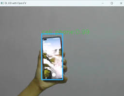

### 📄 `README.md`

```markdown
# 💼 Personal Portfolio - Arul Prasaath B

Welcome to my personal portfolio website! This project showcases my skills, experience, and featured projects as a web developer.

🔗 **Live Demo**: [https://arulbarath-30.github.io/CODSOFT-2/](https://arulbarath-30.github.io/CODSOFT-2/)

---

## 📌 Features

- 🌐 Clean and responsive design using **HTML** and **CSS**
- 👤 About Me section with profile image and introduction
- 🛠 Skills section listing core technical competencies
- 💼 Projects section with sample project showcases
- 📄 Resume download (PDF format)
- 📧 Contact information
- 🔻 Fully deployable on GitHub Pages

---

## 🧩 Project Structure

```

CODSOFT-2/
│
├── portfolio.html          # Main HTML file
├── portfolio.css           # Styling (CSS)
├── arul.PNG.jpeg           # Profile picture
├── mobile.jpg              # Project/sample image
├── ARUL PRASAATH B (3).pdf # Resume (PDF)
└── README.md               # This file

````

---

## 📥 How to Use

1. Clone this repo:
   ```bash
   git clone https://github.com/Arulbarath-30/CODSOFT-2.git
````

2. Open the folder in your code editor (e.g., VS Code)
3. Run `portfolio.html` in your browser

---

## 🚀 Deployment

This site is hosted using **GitHub Pages**.

To deploy manually:

* Go to **Settings > Pages**
* Set source to `main` branch and `/ (root)` folder

---

## 📧 Contact

* **Email**: [your.email@example.com](mailto:your.email@example.com)
* **Phone**: +91-XXXXXXXXXX

---

## 🖥 Preview



---

